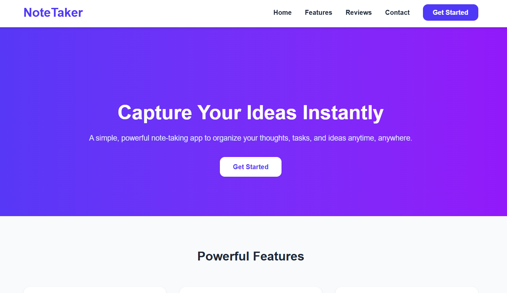
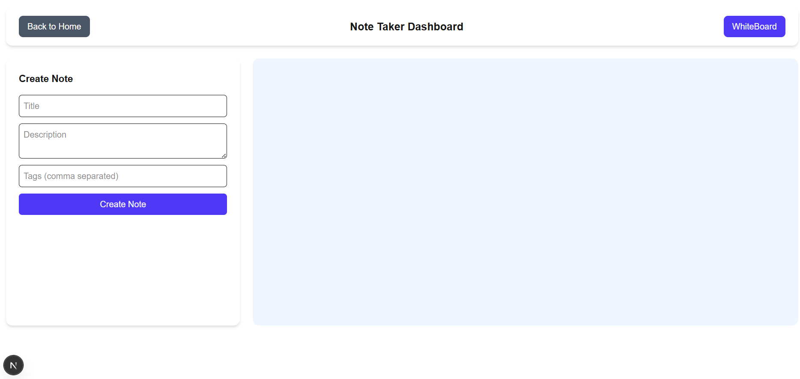
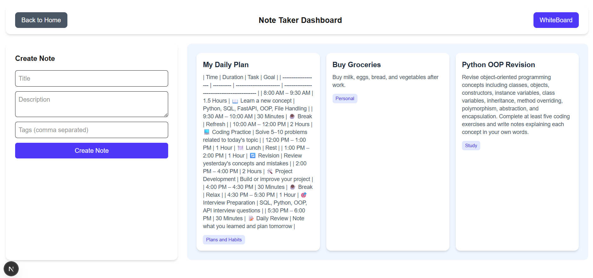

<p align="center">
  
</p>

<h1 align="center">📝 Note Taker App</h1>

<p align="center">
  A modern note-taking application with an integrated whiteboard canvas for visual brainstorming — built with Next.js 16, React 19, and Excalidraw.
</p>

<p align="center">
  
  
  
  
  
</p>

---

## 📑 Table of Contents

- [Screenshots](#-screenshots)
- [Features](#-features)
- [Tech Stack](#-tech-stack)
- [Folder Structure](#-folder-structure)
- [Getting Started](#-getting-started)
- [Available Scripts](#-available-scripts)
- [License](#-license)

---

## 📸 Screenshots

| Home Page | Feature Page |
|:-:|:-:|
|  | .png) |

| Notes Page | Note Details |
|:-:|:-:|
|  |  |

---

## ✨ Features

- 📝 **Rich Note Taking** — Create, edit, and organize notes with a clean interface
- 🎨 **Whiteboard Canvas** — Built-in Excalidraw whiteboard for diagrams, sketches, and visual brainstorming
- 📊 **Dashboard** — Overview of all your notes and quick access
- 🗂️ **Note Organization** — Browse, search, and manage notes efficiently
- 📱 **Responsive Design** — Works seamlessly across desktop and mobile
- ⚡ **Fast & Modern** — Built on Next.js 16 with React 19 for optimal performance

---

## 🛠️ Tech Stack

| Category | Technology |
|----------|-----------|
| **Framework** | Next.js 16 (App Router) |
| **Language** | TypeScript |
| **UI Library** | React 19 |
| **Styling** | Tailwind CSS 4 |
| **Canvas/Drawing** | Excalidraw |
| **Icons** | Lucide React, React Icons |

---

## 📁 Folder Structure

```
note_taker_app/
├── app/
│   ├── components/                # 🧩 Shared UI components
│   ├── dashboard/
│   │   └── page.tsx               # 📊 Dashboard view
│   ├── pages/
│   │   └── Note.tsx               # 📝 Note editor page
│   ├── whiteboard/
│   │   └── page.tsx               # 🎨 Excalidraw whiteboard
│   ├── Navbar.tsx                 # Navigation bar
│   ├── layout.tsx                 # Root layout
│   ├── page.tsx                   # Home / landing page
│   └── globals.css                # Global styles
├── public/
│   └── Project_images/            # 📸 Screenshots
│       ├── home_page.png
│       ├── feature_page (1).png
│       ├── note_page.png
│       └── notes_detail.png
├── package.json
├── tsconfig.json
└── next.config.ts
```

---

## 🚀 Getting Started

### Prerequisites

- **Node.js** 18+
- **npm**, **yarn**, or **pnpm**

### Installation & Setup

```bash
# 1️⃣ Clone the repository
git clone <repository-url>
cd note_taker_app

# 2️⃣ Install dependencies
npm install

# 3️⃣ Start the development server
npm run dev
```

🌐 The app will be available at **http://localhost:3000**

> 💡 This is a frontend-only application — no environment variables or database setup required.

---

## 📜 Available Scripts

| Command | Description |
|---------|-------------|
| `npm run dev` | Start Next.js development server |
| `npm run build` | Create production build |
| `npm run start` | Start production server |

---

## 📄 License

MIT
